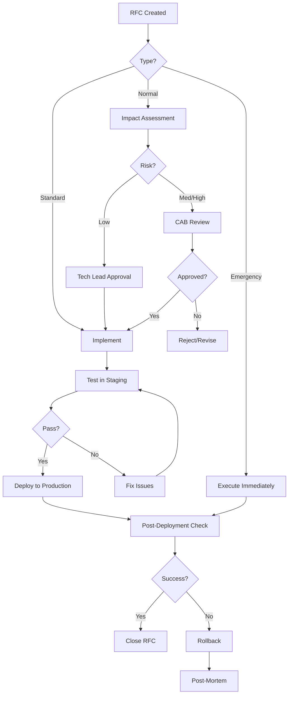

# Change Management Process

**Framework:** ITIL 4 Change Management  
**Versão:** 1.0.0  
**Atualizado:** 2026-01-16

---

## 🎯 Objetivo

Garantir que mudanças sejam implementadas de forma controlada, minimizando riscos e maximizando valor.

---

## 📋 Tipos de Mudança

### 1. Standard Change (Pré-aprovada)
**Definição:** Mudança rotineira, baixo risco, processo bem documentado

**Exemplos:**
- Atualização de documentação
- Script consolidation (comprovadamente seguro)
- Dependency updates (minor/patch)
- Conteúdo estático (images, copy)

**Processo:**
1. Implementar seguindo runbook
2. Testar localmente
3. Criar PR
4. CI passa → Merge
5. Deploy automático
6. Post-deployment check

**Approval:** Pré-aprovado (não requer CAB)

---

### 2. Normal Change
**Definição:** Mudança que requer avaliação e aprovação

**Exemplos:**
- Nova feature
- API changes (breaking ou não)
- Infrastructure changes
- Dependency major upgrades
- Schema migrations

**Processo:**
1. **RFC (Request for Change)**
2. **Impact Assessment**
3. **CAB Review** (se high-risk)
4. **Approval**
5. **Implementation**
6. **Post-Implementation Review**

**Approval:** Tech Lead ou CAB

---

### 3. Emergency Change
**Definição:** Mudança urgente para resolver incidente crítico

**Exemplos:**
- Hotfix de security vulnerability
- Fix de outage em produção
- Rollback de deploy com falha

**Processo:**
1. **Immediate Action** - Fix aplicado
2. **Notification** - Stakeholders notificados
3. **Documentation** - RFC retrospectivo criado
4. **Post-Review** - CAB review após o fato

**Approval:** Post-approval (Tech Lead review após deployment)

---

## 📝 RFC (Request for Change)

### Template

```markdown
# RFC-YYYY-NNN: [Título da Mudança]

## Tipo
- [ ] Standard
- [ ] Normal
- [ ] Emergency

## Descrição
[Descrição clara da mudança]

## Justificativa
[Por que essa mudança é necessária]

## Impacto
**Sistemas afetados:**
- [ ] Backend API
- [ ] Frontend
- [ ] Database
- [ ] External integrations

**Downtime esperado:** [Sim/Não/Tempo]

**Rollback plan:** [Como reverter se necessário]

## Riscos
**High/Medium/Low**
[Descrição dos riscos]

## Testes
- [ ] Unit tests
- [ ] Integration tests
- [ ] Manual testing
- [ ] Staging validation

## Schedule
**Preferred window:** [Data/hora]
**Alternative:** [Data/hora]

## Approval
- [ ] Tech Lead
- [ ] CAB (se necessário)
```

---

## 🏛️ Change Advisory Board (CAB)

### Composição
- **Tech Lead** (chair)
- **Security Lead**
- **Product Owner**
- **DevOps Lead** (ad-hoc)

### Quando Convocar
- High-risk changes
- Breaking API changes
- Infrastructure mudanças
- Major releases

### Meeting
- **Frequência:** Semanal (ou ad-hoc)
- **Duração:** 30 min
- **Agenda:** Review RFCs pendentes
- **Decision:** Approve/Reject/Request more info

---

## ⚖️ Impact Assessment

### Risk Factors

| Factor | Weight | Scoring |
|--------|--------|---------|
| **Complexity** | 3x | 1-5 |
| **Scope** | 2x | 1-5 |
| **Reversibility** | 2x | 1-5 (5=easy rollback) |
| **Testing** | 1x | 1-5 (5=comprehensive) |

**Risk Score = (Complexity × 3 + Scope × 2 + Reversibility × 2 + Testing × 1) / 8**

- **Low Risk:** < 2.0
- **Medium Risk:** 2.0 - 3.5
- **High Risk:** > 3.5

### Decision Matrix

| Risk | CAB? | Staging Required? | Deployment Window |
|------|------|-------------------|-------------------|
| **Low** | No | Optional | Anytime |
| **Medium** | Optional | Yes | Business hours |
| **High** | Yes | Mandatory | Maintenance window |

---

## 🚀 Deployment Windows

### Preferred Windows
- **Standard:** Anytime (CD)
- **Normal:** Tue-Thu, 10am-4pm (rollback time available)
- **Emergency:** Anytime

### Blackout Windows
- ❌ Friday after 2pm
- ❌ Weekends/holidays (unless emergency)
- ❌ Durante campanhas críticas (Black Friday, etc)

---

## 🔄 Change Workflow



---

## ✅ Post-Implementation Review

**Para todas Normal e Emergency changes:**

### Checklist
- [ ] Change implemented as planned?
- [ ] No unexpected issues?
- [ ] Performance acceptable?
- [ ] Rollback plan tested?
- [ ] Documentation updated?
- [ ] Stakeholders notified?

### Post-Mortem (se issues)
- Root cause
- What went well
- What went wrong
- Action items
- Runbook updates

---

## 📊 Change Metrics

### KPIs
- **Change Success Rate:** > 95%
- **Emergency Changes:** < 5% of total
- **Mean Time to Implement:** Target by type
- **Rollback Rate:** < 5%

### Reporting
- **Weekly:** Change summary (count, types, failures)
- **Monthly:** Trend analysis
- **Quarterly:** Process improvement review

---

## 📚 Change Log

Todas mudanças documentadas em `CHANGELOG.md` usando Conventional Commits:

```
### [Version] - YYYY-MM-DD

#### Added
- New feature X (RFC-2026-001)

#### Changed
- Modified API endpoint Y (RFC-2026-002)

#### Fixed
- Bug Z (RFC-2026-003)
```

---

## 🔗 Related Processes
- [Release Management](release-management.md)
- [Incident Management](incident-management.md)
- [Security Policy](../policies/security-policy.md)

---

**Aprovado por:** [Pending]  
**Próxima revisão:** 2026-07-16
