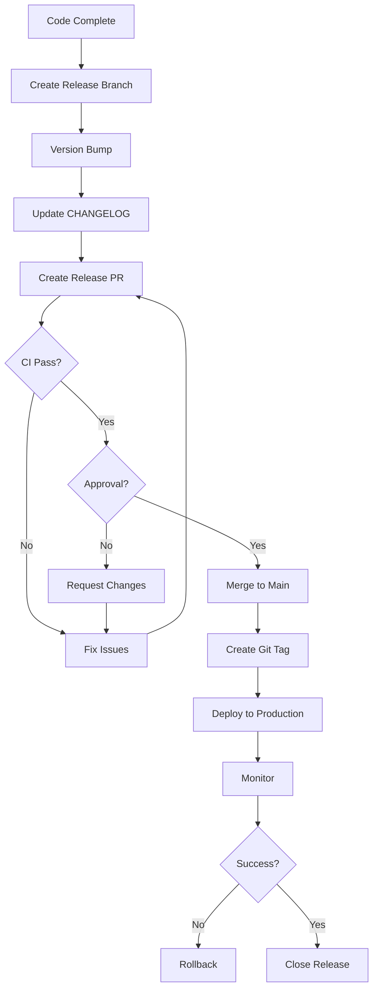

# Release Management

**Framework:** ITIL 4 Release Management  
**Versão:** 1.0.0  
**Atualizado:** 2026-01-16

---

## 🎯 Objetivo

Planejar, agendar e controlar movimento de releases para produção.

---

## 📦 Versioning Strategy

### Semantic Versioning 2.0.0

**Format:** `MAJOR.MINOR.PATCH`

- **MAJOR:** Breaking changes (incompatível)
- **MINOR:** New features (backward-compatible)
- **PATCH:** Bug fixes (backward-compatible)

**Examples:**
- `1.0.0` → `1.0.1` (hotfix)
- `1.0.0` → `1.1.0` (nova feature)
- `1.0.0` → `2.0.0` (breaking change)

**Pre-release:** `1.0.0-beta.1`, `1.0.0-rc.1`

---

## 🔄 Release Types

### 1. Major Release
**Frequency:** Trimestral  
**Scope:** Breaking changes, major features  
**Example:** v2.0.0

**Process:**
1. Feature freeze 2 weeks before
2. Beta testing (1 week)
3. RC (Release Candidate) testing (1 week)
4. Deploy to production
5. Monitor 48h

**Approval:** CAB required

---

### 2. Minor Release
**Frequency:** Mensal  
**Scope:** New features, enhancements  
**Example:** v1.1.0

**Process:**
1. Feature complete 1 week before
2. Staging validation
3. Deploy to production
4. Monitor 24h

**Approval:** Tech Lead

---

### 3. Patch Release
**Frequency:** Semanal ou as-needed  
**Scope:** Bug fixes, small improvements  
**Example:** v1.0.1

**Process:**
1. Fix developed & tested
2. PR merged
3. CI passes
4. Deploy immediately (or next window)

**Approval:** Automated (CI green)

---

### 4. Hotfix
**Frequency:** Emergency  
**Scope:** Critical bugs, security fixes  
**Example:** v1.0.2

**Process:**
1. Create hotfix branch from main
2. Fix & test
3. PR emergency review
4. Deploy ASAP
5. Merge back to main and develop

**Approval:** Tech Lead (retrospective CAB)

---

## 📅 Release Schedule

### Regular Releases
**Day:** Terça-feira  
**Time:** 10:00 AM BRT  
**Window:** 10:00 - 16:00 (rollback time)

**Blackouts:**
- ❌ Sexta/Fim de semana
- ❌ Feriados
- ❌ Black Friday, Cyber Monday
- ❌ Campanhas especiais

---

## 🚀 Release Workflow



---

## 📝 Release Checklist

### Pre-Release
- [ ] All features merged to develop
- [ ] CHANGELOG.md updated
- [ ] Version bumped (`package.json`, `__version__`)
- [ ] Release notes drafted
- [ ] Staging validation passed
- [ ] Migration scripts ready (if DB changes)
- [ ] Rollback plan documented

### Release
- [ ] Create release branch `release/vX.Y.Z`
- [ ] Final testing
- [ ] Create release PR
- [ ] CI green
- [ ] Approval obtained
- [ ] Merge to main
- [ ] Tag created `git tag -a vX.Y.Z`
- [ ] Deploy triggered

### Post-Release
- [ ] Deployment verified
- [ ] Health checks passing
- [ ] Smoke tests run
- [ ] Users notified (if major)
- [ ] Monitor for 24-48h
- [ ] Merge release branch to develop
- [ ] Delete release branch

---

## 📋 Release Notes Template

```markdown
# Release vX.Y.Z - YYYY-MM-DD

## 🎉 Highlights
[Key features/improvements]

## ✨ New Features
- Feature A ([#123](link))
- Feature B ([#124](link))

## 🐛 Bug Fixes
- Fixed issue X ([#125](link))
- Resolved problem Y ([#126](link))

## ⚡ Performance
- Improved Z by 20%

## 🔒 Security
- Patched vulnerability CVE-XXXX

## 📚 Documentation
- Updated API docs

## ⚠️ Breaking Changes
- None

## 🔧 Migrations
```bash
# Run migrations (if any)
supabase db push
```

## 📊 Metrics
- Response time: -10%
- Error rate: -5%

## 👥 Contributors
@username1, @username2
```

---

## 🏷️ Git Tagging

### Create Tag
```bash
# Annotated tag
git tag -a v1.2.0 -m "Release v1.2.0: Feature X"

# Push tag
git push origin v1.2.0
```

### Tag Format
`vMAJOR.MINOR.PATCH`

Examples: `v1.0.0`, `v2.1.3`, `v1.0.0-beta.1`

---

## 🔙 Rollback Process

### Quick Rollback (< 1h)
```bash
# 1. Revert to previous tag
git revert HEAD --no-commit
git commit -m "Rollback to v1.1.0"
git push origin main

# 2. Redeploy triggered automatically

# 3. Verify
curl https://api.com/health
```

### Full Rollback (> 1h)
```bash
# 1. Create rollback branch
git checkout -b hotfix/rollback-v1.2.0 v1.1.0

# 2. Create PR
gh pr create --title "Rollback to v1.1.0"

# 3. Emergency merge
gh pr merge --merge

# 4. Monitor recovery
```

---

## 📊 Release Metrics

### Deployment Metrics
- **Deployment Frequency:** Target weekly
- **Lead Time for Changes:** < 1 day
- **Change Failure Rate:** < 5%
- **Mean Time to Restore:** < 1h

### Release Quality
- **Bugs in Release:** < 3
- **Rollback Rate:** < 5%
- **Post-Release Hotfixes:** < 1

**Dashboard:** [TBD]

---

## 🎯 Environments

### Development
**URL:** `http://localhost:3000`  
**Deploy:** Automatic (on push to develop)  
**Purpose:** Active development

### Staging
**URL:** `https://staging.afiliadobot.top`  
**Deploy:** Automatic (on push to develop)  
**Purpose:** Pre-production validation

### Production
**URL:** `https://afiliadobot.top`  
**Deploy:** Automatic (on push to main + tag)  
**Purpose:** Live environment

---

## 🔗 Related Processes
- [Change Management](change-management.md)
- [CI/CD Workflow](../../.github/workflows/ci.yml)

---

**Aprovado por:** [Pending]  
**Próxima revisão:** Trimestral
